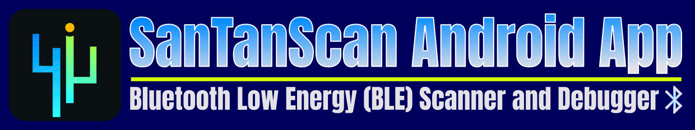
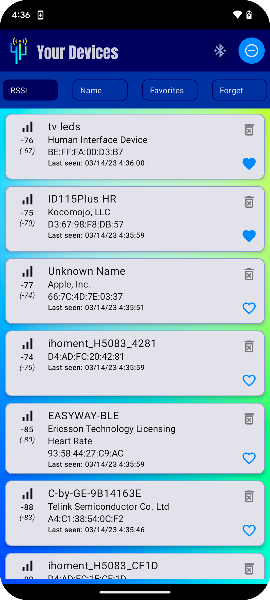
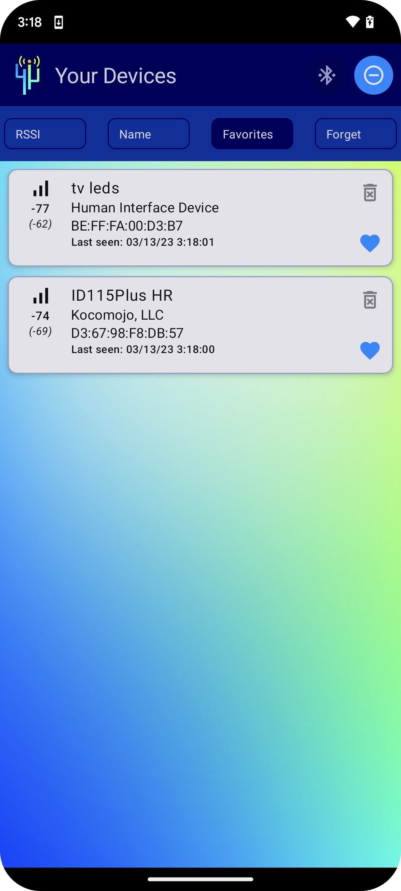
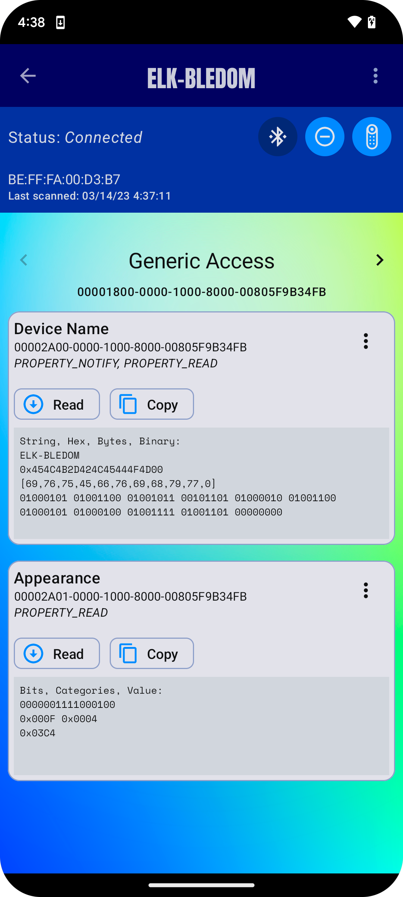
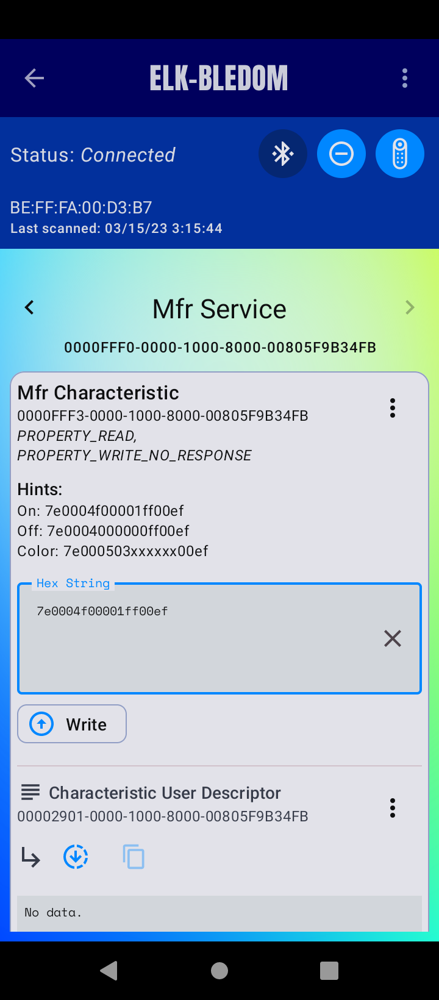
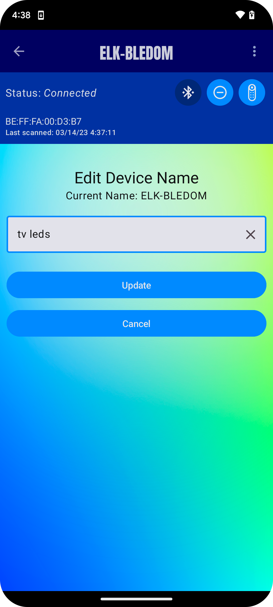
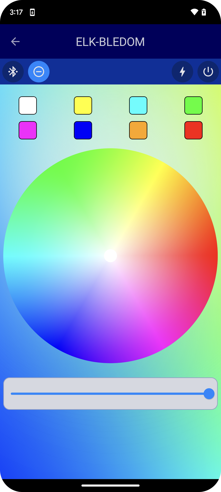

SanTanScan is a Bluetooth Low Energy (BLE) scanner and debugger available for Android 9+. It scans your
home or office for any nearby BLE devices, allowing you to sort by signal strength (RSSI), device name, 
and your favorite devices. From the home screen, you can also selected devices to 'forget'.

Our BLE scan displays the following information:

* Device Name, or 'Unknown'
* Advertised Services
* Manufacturer Name
* Device Address
* RSSI Strength
* Last Seen Date

Once you click on a device, you can easily update its name. If you're a developer or an IoT
enthusiast, we've got you covered too! Once a device is connected with BLE Gatt, all of its
services are displayed, allowing you to easily page through each of them. You can read from each 
characteristic and descriptor, which returns BLE device data in the following formats:

* Text/String, when possible
* Hex String
* Byte Array
* Binary Data

SanTanScan also parses the following services based on Bluetooth specifications:

* Device Name
* Appearance
* Peripheral Preferred Connection

If notifications are enabled, each service will also display notification data, if it's available.
Once the data is read, you can copy it with one simple click. If the device allows it, you can also
write to characteristics and descriptors. This allows you to control and communicate with your BLE
devices to debug and validate all of your services.

**ELK-BLEDOM Devices**

Own an LED light strip? SanTanScan might be able to control it! If your device shows up as 
ELK-BLEDOM, our app supports turning your light strip on and off, and changing the color and
brightness.

## BLE YouTube Playlist
> A lot's changed in the app since I first started :) If you'd like to following along on my journey, check out the playlist below.

## BLE Scanner App Demo

<table cellspacing="1" cellpadding="1" width="100%">
<tr><td></td>
<td></td></tr>
<tr><td></td>
<td></td></tr>
<tr><td></td>
<td></td>
</tr></table>

# For Developers - Jetpack Compose BLE Scanner with Room, Koin, and JUnit 5

Scan your BLE devices with my new Jetpack Compose app. BLE scans include:

* The device name, if known
* The MAC address
* A list of advertised services
* Manufacturer specific data, when possible
* and a timestamp of when the device was last seen

Includes partial support for [Microsoft Beacon](https://learn.microsoft.com/en-us/openspecs/windows_protocols/ms-cdp/77b446d0-8cea-4821-ad21-fabdf4d9a569).

## Video 1: Prepopulated Room Database, Data Layer Setup, and Room JUnit 5 Tests

https://youtu.be/CpBWF52IOk4

In this video, I go over my data layer, which includes a pre-populated Room database. I’ll also
go over my corresponding JUnit 5 tests. This video features:

* Nordic's [Bluetooth Numbers Database](https://github.com/NordicSemiconductor/bluetooth-numbers-database)
* DB Browser for SQLite
* Room Entities, Dao
* Koin Dependency Injection
* JUnit 5 data layer and Room tests

## Video 2: Android BLE Scanner, Compose Bluetooth Permissions, Koin, and JUnit 5 Tests

https://youtu.be/NqxpAq_5wZs

Check out the user interface for my Android BLE Scanner app, written in Jetpack Compose. I'll go
over my Koin setup, Bluetooth permissions, composables, ScanResult parser, and JUnit 5 tests.

## Video 3: Connect to BLE Devices, Read/Write/Parse Characteristics and Descriptors with Android Bluetooth Gatt

https://youtu.be/mjDDJ3HaBGg

Learn how I use Bluetooth Gatt to connect to my BLE devices. In this video, I'll go over my Bluetooth
Gatt Callback, custom Characteristic parsers including Appearance, Preferred Connection Parameters,
and Client Characteristic Configuration, and my BLE Scanner ViewModel. I'll also go over my
Jetpack Compose BLE Service pager and Compose UI to interact with BLE devices.

## Video 4: Android App Compose Demo: Scan, Debug, and Control BLE Devices

https://youtu.be/ZCs6SXIiObU

In this demo, I go through my Light theme, Dark theme, Portrait and Landscape layouts, and my new 
Control screen, which allows me to control my BLE LED light strip.

## Video 5: Filter and Sort Room Flows, Compose Preview Parameters, JVM 11 JUnit 5 Compose Testing

https://youtu.be/TJ2AlSdMGL4

I'm getting close to the finish line for my BLE Scanner app. In this video, I go over my recent
updates, including Adaptive Layouts, filter and sort features, Compose Preview Parameters, and 
Android tests.

## Privacy Policy

Your privacy is important! To learn about what we collect, check out our <a href="PrivacyPolicy.md" target="_blank" style="color:#e2e2e9">
Privacy Policy</a>.
